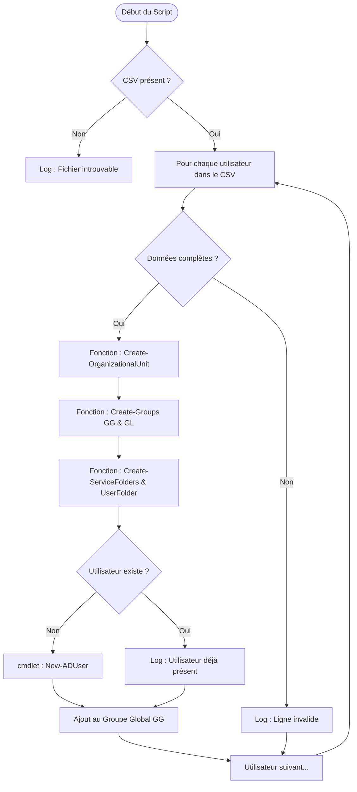

# AD Automation : Provisioning Utilisateurs & Infrastructure

Ce script PowerShell permet d'automatiser l'onboarding des collaborateurs au sein d'un environnement Active Directory. Il traite un fichier CSV pour créer l'arborescence des OUs, les groupes de sécurité, les dossiers de fichiers et les comptes utilisateurs.

---

## 📊 Flux de traitement (Logique Mermaid)

Le diagramme suivant illustre le processus décisionnel et technique exécuté pour chaque ligne du fichier CSV.

## 🚀 Fonctionnalités principales

Le script suit une logique de déploiement en quatre étapes clés 

1. Gestion de l'Arborescence (OU)

Vérification et création : Le script contrôle l'existence de l'OU du Site (ou-Ville) et la crée si nécessaire.

Hiérarchie : Il crée ensuite l'OU du Service (ou-Service) à l'intérieur de l'OU Site correspondante pour respecter la structure hiérarchique.

2. Stratégie de Groupes (AGDLP)

Groupe Global : Création d'un groupe de type Global (GG-NomDuService).

Groupe Local : Création d'un groupe Local de Domaine (GL-NomDuService).

Imbrication : Automatisation du principe AGDLP en ajoutant systématiquement le groupe Global comme membre du groupe Local.

3. Infrastructure de Fichiers

Dossiers de Service : Création des répertoires par service sur le partage réseau (\\SRV-1\services$).

Dossiers Personnels : Création des dossiers personnels basés sur un login formaté (3 premières lettres du prénom + 3 premières lettres du nom).

4. Provisioning Utilisateur

Identifiants : Génération automatique du SamAccountName (Initial prénom + Nom complet).

Profil complet : Remplissage des attributs AD (adresse, CP, ville, date d'embauche dans la description).

Sécurité : Attribution d'un mot de passe temporaire avec obligation de changement à la première connexion.
